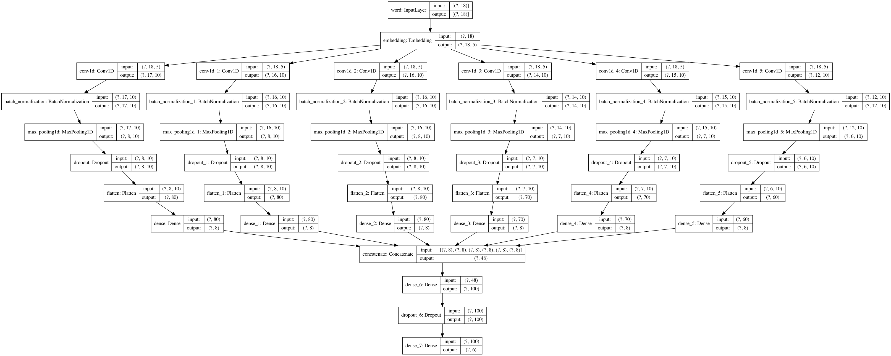

# langclass
Several machine learning models for classifying languages of origin of various words. Models include a 1D convolution-based approached with character embedding, a dense approach with char-embedding, a dense approach without char embedding, and a merged convolutional approach, where multiple kernel sizes and dilations are applied.

The data is from the [IDS](https://ids.clld.org/). The `clean_data.py` file will clean the appropriate data if it is in the same directory, written by me.

All the models except the merged model are topologically simple. Here is a graph of the merged model for convenience, generated by keras:

